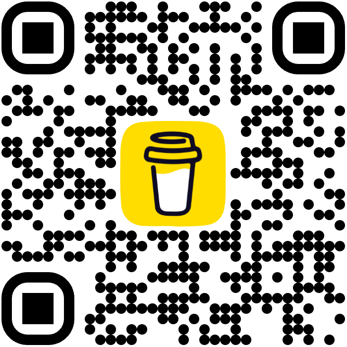

# @affanmomin/agent-workspace

> 🤖 **Intelligent AI Agent Framework Distribution**

Distribute customizable AI agent configurations to your projects. Get the right agents, skills, and workflows based on your project type—frontend, backend, mobile, or any of 9 supported types.

[](https://www.npmjs.com/package/@affanmomin/agent-workspace)
[](https://opensource.org/licenses/MIT)
[](https://www.npmjs.com/package/@affanmomin/agent-workspace)

---

## 🚀 Quick Start

```bash
npx @affanmomin/agent-workspace init
```

That's it! Interactive prompts will guide you through setup.

---

## ✨ Features

- 🎯 **Interactive CLI** - Vite-style user experience
- 🔧 **9 Project Types** - Frontend, Backend, Mobile, Full-Stack, Desktop, CLI, Extension, Game, Monorepo
- 🎨 **Smart Filtering** - Only relevant agents and skills for your project
- ⚙️ **Custom Rules** - Enforce company standards via `.agent-config.json`
- 🔄 **Easy Updates** - `npx @affanmomin/agent-workspace update`
- 🧠 **Conventional Commits** - Supports `npm run commit` for standardized messages
- 🏷️ **Semantic Versioning** - Automated releases with changelog generation

---

## 🤔 Why Use This?

**Problem**: Setting up AI agent configurations manually is time-consuming and error-prone. You end up with:
- ❌ Irrelevant agents for your project type
- ❌ Bloated configurations with unnecessary skills
- ❌ No way to enforce company coding standards
- ❌ Manual updates when the framework changes

**Solution**: `@affanmomin/agent-workspace` automatically:
- ✅ Installs only the agents and skills you need
- ✅ Filters content based on your project type
- ✅ Enforces your custom rules via AI
- ✅ Updates with a single command while preserving your settings

**Result**: Get AI-powered development assistance tailored to your exact needs in under 30 seconds.

---

## 🎯 Project Types

| Type | Agents | Skills | Best For |
|------|--------|--------|----------|
| Frontend | 13 | 24 | React, Next.js, Vue |
| Backend | 13 | 22 | Node.js, Python APIs |
| Mobile | 12 | 19 | React Native, Flutter |
| Full-Stack | 15 | 26 | Complete web apps |
| Monorepo | 20 | 36 | Multi-project workspaces |

Plus: Desktop, CLI, Extension, Game

---

## ⚙️ Configuration

Customize via `.agent-config.json`:

```json
{
  "projectType": "backend",
  "customRules": {
    "additionalRules": "Use Express.js. PostgreSQL database. JWT auth."
  },
  "includedSkills": ["python-patterns"]
}
```

**Custom rules are enforced by the AI** - no manual configuration needed.

---

## 💡 Example

```bash
# Initialize frontend project
npx @affanmomin/agent-workspace init --type frontend

# Update existing project
npx @affanmomin/agent-workspace update
```

---

## 📦 What Gets Installed

```
.
├── .agent-config.json          # Your project configuration
└── .agent/
    ├── ARCHITECTURE.md         # System overview
    ├── agents/                 # Specialist agents (filtered)
    ├── skills/                 # Specialist skills (filtered)
    ├── workflows/              # Interactive workflows
    ├── rules/
    │   └── GEMINI.md          # Global AI rules
    └── scripts/               # Validation scripts
```

---

## 🔗 Links

- **GitHub**: [affanmomin/agent-workspace](https://github.com/affanmomin/agent-workspace)
- **Documentation**: [Configuration Guide](CONFIG_GUIDE.md)
- **Issues**: [Report bugs](https://github.com/affanmomin/agent-workspace/issues)

---

<div align="center">

**Made with ❤️ by [Affan Momin](https://github.com/affanmomin)**

Open source and free forever.

---

### ☕ Support This Project

If you find this helpful, consider supporting my work!

<div align="center">
  <table border="0">
    <tr>
      <td align="center" width="300">
        <p><b>Buy Me A Coffee</b></p>
        <a href="https://buymeacoffee.com/affanmomin" target="_blank">
          
        </a>
        <br/>
        <a href="https://buymeacoffee.com/affanmomin" target="_blank">
          
        </a>
      </td>
      <td align="center" width="300">
        <p><b>Support via OnlyChai (UPI)</b></p>
        <a href="https://onlychai.neocities.org/support.html?name=Affan%20Momin&upi=7378607967%40ybl" target="_blank">
          
        </a>
        <br/>
        <a href="https://onlychai.neocities.org/support.html?name=Affan%20Momin&upi=7378607967%40ybl" target="_blank">
          <b>OnlyChai ✨</b>
        </a>
      </td>
    </tr>
  </table>
</div>

</div>
